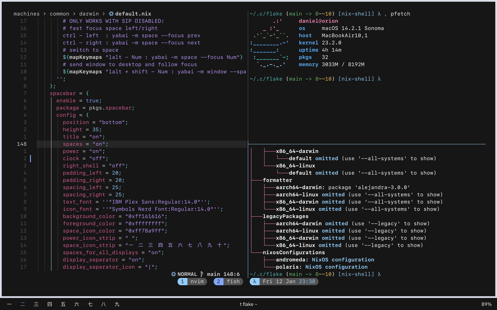

# x0ba's dotfiles

## Images




## Software

- Terminal: [Ghostty](https://discord.gg/ghostty)
- Multiplexer: [tmux](https://github.com/tmux/tmux) with [t-smart-session-manager](https://github.com/joshmedeski/t-smart-tmux-session-manager)
- Shell: [fish](https://fishshell.com/)
- Font: [SF Mono](https://developer.apple.com/fonts/)
- Colorscheme: [Oxocarbon](https://github.com/nyoom-engineering/base16-oxocarbon)
- Window Manager: [Yabai](https://github.com/koekeishiya/yabai) with [skhd](https://github.com/koekeishiya/skhd)
- Bar: [Spacebar](https://github.com/cmacrae/spacebar)
- Editor: [Neovim](https://neovim.io/)/[VSCode](https://code.visualstudio.com/)
- File Manager: [lf](https://github.com/gokcehan/lf)

## Installing and Notes

This flake technically has an impurity at its core, because it assumes that it will be stored in `~/.config/flake` and will create symlinks pointing there.
This is so I can edit some dotfiles (e.g. VSCode `settings.json`) in place and have programs hot reload them.

### macOS

#### Install the [Xcode Command Line Tools](https://developer.apple.com/download/all/)

```console
xcode-select --install
```

#### Install Nix

I like using the [Determinate Systems Installer](https://github.com/DeterminateSystems/nix-installer), though you can also use the [official installer](https://nixos.org/download.html).

```console
curl --proto '=https' --tlsv1.2 -sSf -L https://install.determinate.systems/nix | sh -s -- install
```

#### Install [Homebrew](https://brew.sh)

```console
curl -fsSL https://raw.githubusercontent.com/Homebrew/install/HEAD/install.sh | bash
```

#### Exclude `/nix/` from Time Machine

```console
sudo tmutil addexclusion -v /nix
```

### Building the flake

```console
nix --experimental-features "nix-command flakes" develop # enter the devShell
just switch
```

I personally use [`nix-direnv`](https://github.com/nix-community/nix-direnv) to automatically enter this devShell on my machines.

