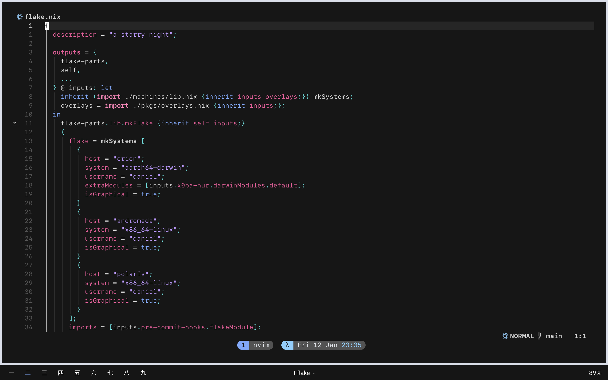

#+TITLE: x0ba's dotfiles
#+AUTHOR: Daniel Xu (x0ba)

* x0ba's dotfiles

** Images
 [[./extra/assets/shot2.png]]

** Software
- Terminal: [[https://discord.gg/ghostty][Ghostty]]
- Multiplexer: [[https://github.com/tmux/tmux][tmux]] with [[https://github.com/joshmedeski/t-smart-tmux-session-manager][t-smart-session-manager]]
- Shell: [[https://fishshell.com/][fish]]
- Font: [[https://github.com/be5invis/Fira Code][Fira Code]]
- Colorscheme: My Own
- Window Manager: [[https://github.com/koekeishiya/yabai][Yabai]] with [[https://github.com/koekeishiya/skhd][skhd]]
- Bar: [[https://github.com/cmacrae/spacebar][Spacebar]]
- Editor: [[https://neovim.io/][Neovim]]/[[https://code.visualstudio.com/][VSCode]]/[[https://github.com/doomemacs/doomemacs][Doom Emacs]]
- File Manager: [[https://github.com/gokcehan/lf][lf]]/[[https://www.gnu.org/software/emacs/manual/html_node/emacs/Dired.html][dired]]

** Installing and Notes
This flake technically has an impurity at its core, because it assumes that it will be stored in =~/.config/flake= and will create symlinks pointing there. This is so I can edit some dotfiles (e.g. VSCode ==settings.json==) in place and have programs hot reload them.

*** macOS
**** Install the [[https://developer.apple.com/download/all/][Xcode Command Line Tools]]

#+begin_src console
xcode-select --install
#+end_src

**** Install Nix
I like using the [[https://github.com/DeterminateSystems/nix-installer][Determinate Systems Installer]], though you can also use the [[https://nixos.org/download.html][official installer]].

#+begin_src console
curl --proto '=https' --tlsv1.2 -sSf -L https://install.determinate.systems/nix | sh -s -- install
#+end_src

**** Install [[https://brew.sh][Homebrew]]

#+begin_src console
curl -fsSL https://raw.githubusercontent.com/Homebrew/install/HEAD/install.sh | bash
#+end_src

**** Exclude =/nix/= from Time Machine
:PROPERTIES:
:CUSTOM_ID: exclude-nix-from-time-machine
:END:
#+begin_src console
sudo tmutil addexclusion -v /nix
#+end_src

*** Building the flake

#+begin_src console
nix --experimental-features "nix-command flakes" develop # enter the devShell
just switch
#+end_src

I personally use [[https://github.com/nix-community/nix-direnv][=nix-direnv=]] to automatically enter this devShell on my machines.
